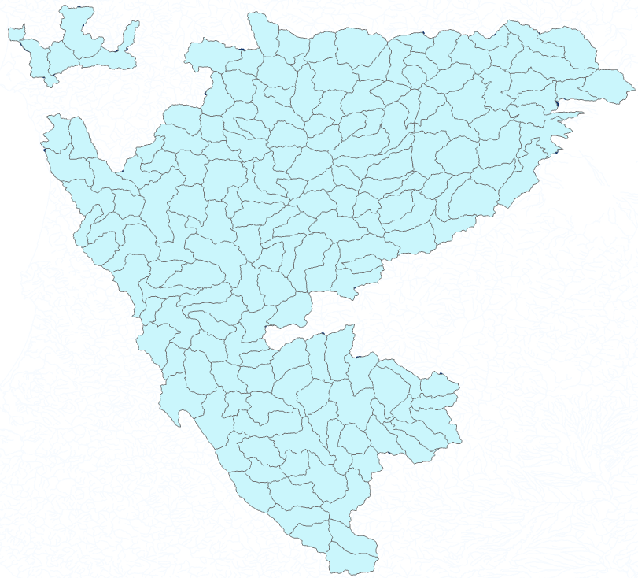

# Probabilistic PISCES
Transforms PISCES HUC12 level species occurrence data to NHD Stream Segment level by assigning probabilities of
occurrence based on stream order.

## The problem
While California contains about 4,600 HUC12s, it contains ~160,000 NHD Stream Segments. The HUC12s are the coarsest
valid observation unit in PISCES, so this scale adjustment adds additional uncertainty to the species records. In order
to attach this additional uncertainty, the code here uses an approach based on Strahler stream order and the species'
entire range to probabilistically assign species to segments within their broader range. This approach is more valid for
wide ranging species than those with narrow ranges, or which are resident in lakes. 

While PISCES data contain range information, it is granular enough to often be used to represent *actual* presence
in streams within a watershed. Based on the scale mismatch, it is risky to make this assumption. This code is an effort
to better represent uncertainty at the stream segment level if the data are being used that way. It also represents a first pass
estimate, not a rigorous evaluation of species presence at the stream segment level. **Use it only very carefully and if
you understand both the transformation described below and what it means for the data.**

## The approach
First we calculate a "prime" stream order for each species. We assume that if a species is in a HUC12, then it is in
*at least* that HUC12's outlet stream segment (remember, this is valid for wide ranging species, not narrow-ranged
or lake resident). Across the species' *historical* range, we find the minimum Strahler stream order of these
outlet segments, and make that the "prime" stream order, which represents the stream order above which we assume the
species to be present, at least within their *current* range. More formal representations of this calculation
are forthcoming, or [get in touch](https://watershed.ucdavis.edu/user/64/contact)

## Results
See [Releases](https://github.com/ceff-tech/ProbabilisticPISCES/releases) for the latest data and information on using it.