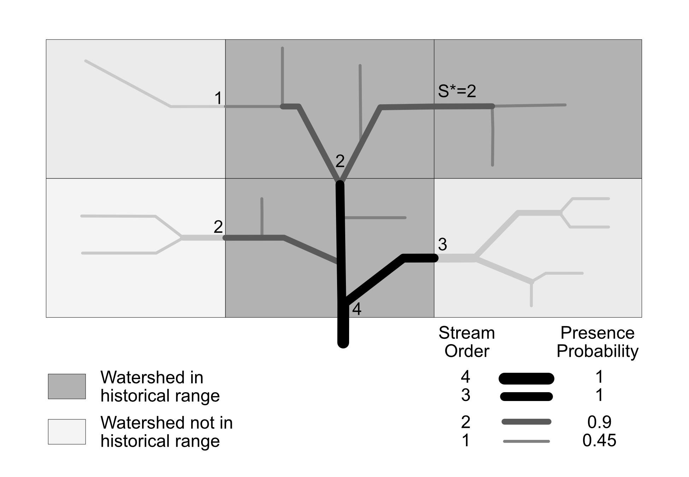

# Probabilistic PISCES
Transforms PISCES HUC12 level species occurrence data to NHD Stream Segment level by assigning probabilities of
occurrence based on stream order.

## The problem
While California contains about 4,600 HUC12 subwatersheds, it contains ~160,000 NHD Stream Segments. The HUC12s are the coarsest
valid observation unit in [PISCES](https://pisces.ucdavis.edu), so this scale adjustment adds additional uncertainty to the species records. In order
to attach this additional uncertainty, the code here uses an approach based on Strahler stream order and the species'
entire range to probabilistically assign species to segments within their broader range. This approach is more valid for
wide ranging species than those with narrow ranges, or which are resident in lakes. 

While PISCES data contain range information instead of direct locational observations, it is granular enough to often be used to represent *actual* presence
in streams within a watershed. Based on the scale mismatch between HUC12s and stream reaches, it is risky to make this assumption. This code is an effort
to better represent uncertainty at the stream segment level if the data are being used that way. It also represents a first pass
estimate, not a rigorous evaluation of species presence at the stream segment level. **Use it only very carefully and if
you understand both the transformation described below and what it means for the data.**

## The approach

We start by calculating each taxon’s primary stream order, the stream order value above
which we assume the taxon is present and below which we decrease probability they
are present. The calculation of primary stream order is based on an assumption that
most fish taxa in California will be present in the stream segment in a subwatershed that
connects it to the downstream subwatershed, since that segment ensures connectivity of
the range. Depending on the taxon, they may or may not be present in other segments,
but a conservative estimate that works for most taxa suggests they are at least in this
connecting segment. This assumption will not hold for all species. Some are highly endemic, and others like tributaries.
But it works as a first pass for downscaling a large dataset and can be refined with more information
later.

The segment that connects each subwatershed to a downstream subwatershed will
have the largest stream order in the upstream subwatershed. Once we have largest stream
order value for each subwatershed, we examine each taxon individually and gather all of
the connecting stream order values for subwatersheds within the taxon’s range. For each
taxon, we select the lowest value as their primary stream order (see image).

Once we have a primary stream order value for each taxon, we apply presence probabilistically to all segments within their subwatershed-based range. Any stream segment
in their range that exceeds the primary stream order is assigned a presence probability
of 1, while segments with the primary stream order are assigned a probability of 0.9 to
reflect some uncertainty. Stream segments with smaller stream orders receive smaller
presence values according to the function 0.9 * 0.5^(S*−S) where S* is the primary stream
order for the taxon and S is the stream order of the segment being evaluated.

| S*  | S=5  | S=4   | S=3    | S=2     | S=1    |
|-----|------|-------|--------|---------|--------|
| 1   | 1    | 1     | 1      | 1       | 0.9    |
| 2   | 1    | 1     | 1      | 0.9     | 0.45   |
| 3   | 1    | 1     | 0.9    | 0.45    | 0.225  |
| 4   | 1    | 0.9   | 0.45   | 0.225   | 0.1125 |
| 5   | 0.9  | 0.45  | 0.225  | 0.1125  | 0.0563 |
Here are the probabilities used for each stream order based on the primary stream order for a species

## Results
See [Releases](https://github.com/ceff-tech/ProbabilisticPISCES/releases) for the latest data and information on using it.